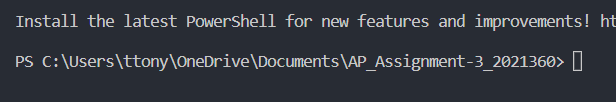

For running all the java Programs,
Please check whether you are in the same directory or not
For doing so, you can select the folder and click "run in terminal"/"open in terminal"
Make sure you have something like this in the end:

For running the Part-A of Assignment-3
Run the following commands in terminal:
>javac oddEvenSort.java\
>java oddEvenSort

For running the Part-B of Assignment-3
Run the following commands in terminal:
>javac balancedbinaryTree.java\
>java balancedbinaryTree

If you are using Linux or Mac distro and have the "make" packages installed then you can simply do this:
Alternatively, you can also run the makefile in the terminal, by executing the following command in the terminal:
>make

But make sure you are in the same folder/directory for running the makefile command

Implementation Details:
Part-A
1) Generated a Random Array using Math.random of floating point values
2) Duplicated it into two arrays namely: arr1 and arr2
3) Sorts them without Threads and with Threads

Part-B
1) Generated a Random Array using Math.random of integer values between [10pow-9, 10pow9] 
2) Created a class Node and used it to build tree without Threads and with 2 and 4 threads each
3) Measured the height without threads and with 2 and 4 threads each
2) Generated a random number in the limit of size of the array and used it to find that randomly generated index-element in the array
3) This is used as the search element for searching in without threads, with 2 and 4 threads too.